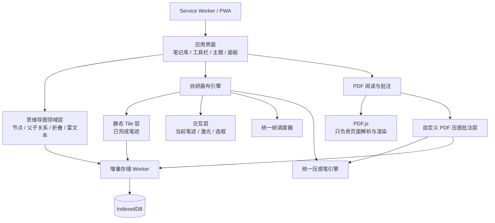

<div align="center">

# Infinite Mindmap

### 无限画布思维导图 · 本地优先的可视化学习与知识工作台

把 **思维导图、自由书写、富文本、PDF 阅读与压感批注** 放在同一张无限画布中。

[在线体验](https://9leaa.github.io/infinite-mindmap/?v=18.3) ·
[问题反馈](https://github.com/9leaa/infinite-mindmap/issues) ·
[测试报告](./TEST_REPORT.md)


</div>

---

## 项目简介

Infinite Mindmap 是一款运行在浏览器中的无限画布笔记工具，面向学习、阅读、知识整理和手写批注场景。

它不是单纯的思维导图，也不是给现成白板套一层外壳。项目保留独立的节点系统、文本编辑器、手写引擎、PDF 阅读器和本地存储层，让用户能够在同一个工作区中完成：

- 建立知识结构；
- 拖拽和连接节点；
- 使用 Apple Pencil 自由书写；
- 在 PDF 上进行压感批注；
- 添加富文本和自由文字；
- 在 Mac、iPad 和桌面浏览器之间使用统一交互；
- 将全部数据保存在本地浏览器中。

> 画布、节点、手写、工具栏和批注系统均为项目自研。项目参考了成熟白板产品的静态层/交互层分离、按需渲染和帧合并思想，但不依赖 Excalidraw 作为运行内核。

---

## 功能概览

### 无限画布与思维导图

- 无限平移和缩放画布；
- 创建独立节点和子节点；
- 一个父节点可以连接多个子节点；
- 拖拽节点并实时更新关系线；
- 节点展开、折叠和分支隐藏；
- 节点标题与正文独立编辑；
- 节点内容增加时自动扩展高度；
- 支持自由文字、图片和附件卡片；
- 支持浅色、深色和护眼主题。

### 富文本与自由文字

- 局部修改字号、颜色、粗体、斜体、下划线和高亮；
- 多种局部格式可以叠加，不会因修改字号而覆盖已有颜色；
- `Tab` 在编辑位置插入四个空格；
- 按 `T` 在鼠标最后所在的画布位置创建文字框；
- 自由文字框手动调整宽度，高度随内容和换行自动增长；
- 文本过多时不会在文字框内部出现纵向滚动条。

### 自由书写与 Apple Pencil

- 钢笔；
- 水彩笔；
- 激光笔；
- 像素/对象擦除；
- 颜色与粗细调节；
- Apple Pencil 压力、速度和倾角采样；
- 主画布与 PDF 批注共用压力模型；
- 使用合并采样和 Pointer/Touch 后备通道减少短笔画丢失；
- Pencil 书写与手指平移分离；
- 手指平移、双指缩放和防误触处理。

### PDF 阅读与批注

- 右侧连续多页阅读；
- 当前页优先渲染，相邻页面按需预加载；
- 支持中文 CMap、标准字体和图像解码资源；
- 阅读模式与批注模式切换；
- 在 PDF 上使用自研压感笔引擎书写；
- 批注使用页面归一化坐标，缩放或改变面板宽度后保持位置；
- Pencil 书写期间锁定页面位置，普通手指仍可滚动；
- PDF 面板可拖到接近全屏；
- 支持适宽、缩放、页码定位和系统阅读器打开；
- 加载或渲染过程中仍可立即关闭阅读面板。

### 本地数据与备份

- 多笔记管理；
- 数据保存到浏览器 IndexedDB；
- 手写和 PDF 批注逐条增量写入；
- Dedicated Worker 负责高频存储任务；
- 支持笔记库导入与导出；
- 支持离线使用和 PWA 安装；
- 默认不需要账户、服务器或数据库。

---

## 设计目标

| 目标 | 实现方式 |
|---|---|
| 书写时不重画全部历史内容 | 已完成笔迹进入静态分块缓存，当前笔迹使用独立交互层 |
| 平移时不重复栅格化整个世界画布 | 只保留当前视口和周边分块 |
| 高频事件不重复触发完整渲染 | 使用统一 `requestAnimationFrame` 调度器合并更新 |
| 写完一笔不保存整个笔记库 | 每条笔迹独立写入 IndexedDB |
| PDF 与主画布拥有一致笔感 | 共用压感采样、线宽计算和笔迹数据模型 |
| iPad 输入流中断时尽量保留笔迹 | Pointer Events、合并事件和 stylus Touch Events 协同采样 |
| 页面渲染不打断正在进行的批注 | 当前页高清升级延迟到抬笔后执行 |
| 数据尽可能留在用户设备 | Local-first，无后端依赖 |

---

## 架构



### 关键模块

#### 自研分块画布

历史笔迹不会一直堆积在单张超大 Canvas 中。画布根据世界坐标划分为多个 Tile，只创建当前视口和周边区域需要的分块。

新增或擦除笔迹时，仅将受影响的 Tile 标记为脏；平移过程中优先移动已缓存的分块，而不是重新绘制全部历史内容。

#### 静态层与交互层分离

- **静态层**：已完成笔迹；
- **交互层**：正在书写的一笔、激光笔和临时操作状态；
- **DOM 层**：节点、文字、工具栏和阅读面板。

Apple Pencil 移动时主要更新交互层，抬笔后再把完整笔迹提交到静态分块。

#### 统一压感笔引擎

每个采样点可保存：

```text
x / y / smoothedPressure / rawPressure / timestamp
tiltX / tiltY / altitudeAngle / azimuthAngle
```

线宽由压力曲线和移动速度共同计算。主画布与 PDF 批注共享同一笔迹模型，避免两个区域出现完全不同的书写手感。

#### 增量存储

手写和 PDF 批注不会在每次修改后复制整套笔记库，而是按记录独立写入：

```text
一条新笔迹      → 一条 ink-strokes 记录
一条 PDF 批注   → 一条 pdf-annotations 记录
节点或文本变化  → 更新对应文档状态
```

高频存储通过 Dedicated Worker 执行，降低主线程阻塞。

---

## 快速开始

### 在线使用

直接打开：

**https://9leaa.github.io/infinite-mindmap/?v=18.3**

首次访问后，静态资源会由 Service Worker 缓存，可以作为 PWA 使用。

### 安装到主屏幕

#### iPad / iPhone

1. 使用 Safari 打开在线地址；
2. 点击“分享”；
3. 选择“添加到主屏幕”。

#### Chrome / Edge

打开浏览器地址栏或菜单中的“安装应用”。

### 本地运行

本仓库本身就是可直接部署的静态站点，不需要构建步骤。

```bash
git clone https://github.com/9leaa/infinite-mindmap.git
cd infinite-mindmap
python3 -m http.server 8080
```

然后访问：

```text
http://localhost:8080/
```

不建议直接双击 `index.html` 使用 `file://` 打开，因为浏览器可能限制 Module Worker、PDF Worker 和 Service Worker。

---

## 基础使用

### 创建思维导图

1. 点击“节点”创建独立根节点；
2. 选中节点后点击“子节点”；
3. 使用“连接”模式手动建立父子关系；
4. 连接完成后可以继续点击多个目标，让一个父节点连接多个子节点；
5. 拖拽节点调整结构。

### 创建文字

- 点击工具栏“文字”：在当前视口中心建立文字框；
- 将鼠标移动到目标位置后按 `T`：在鼠标位置建立文字框；
- 编辑时按 `Tab`：插入四个空格；
- 拖拽文字框宽度后，高度会自动适应换行内容。

### 手写

1. 切换到钢笔或水彩笔；
2. 使用 Apple Pencil 或鼠标书写；
3. 使用手指平移画布；
4. 使用双指缩放；
5. 通过颜色和粗细控件调整笔刷。

### PDF 批注

1. 导入 PDF；
2. 点击 PDF 卡片打开右侧阅读区；
3. 切换到“批注模式”；
4. 使用 Pencil 书写，使用手指滚动页面；
5. 批注会保存到当前 PDF 记录中。

---

## 数据与隐私

Infinite Mindmap 是 **Local-first** 应用。

- 笔记、节点、笔迹、PDF 和批注默认保存在当前浏览器的 IndexedDB；
- 项目没有后端服务器，也不要求登录；
- 数据不会自动同步到其他设备；
- 浏览器“清除网站数据”会删除本地笔记；
- 更换浏览器、设备或域名时，原 IndexedDB 数据不会自动迁移；
- 在清理缓存、升级版本或更换设备前，请先执行完整备份。

> 无痕模式、系统存储不足和浏览器自动清理可能影响数据持久性，不建议在无痕窗口中长期使用。

---

## 项目结构

```text
.
├── index.html                     # 主应用与自研画布逻辑
├── manifest.webmanifest           # PWA 配置
├── sw.js                          # 离线缓存与版本更新
├── workers/
│   └── storage-worker.js          # 手写与批注增量存储 Worker
├── vendor/
│   ├── pdf.mjs                    # PDF.js 主模块
│   ├── pdf.worker.mjs             # PDF.js Worker
│   ├── cmaps/                     # 字符映射资源
│   ├── standard_fonts/            # 标准字体资源
│   ├── image_decoders/            # 图像解码资源
│   └── LICENSE_PDFJS
├── .github/workflows/pages.yml    # GitHub Pages 自动部署
├── TEST_REPORT.md                 # 当前版本回归测试说明
├── TEST_RESULTS.json              # 自动测试结果
├── DEPLOYMENT.md                  # 部署说明
└── THIRD_PARTY_NOTICES.md         # 第三方组件与许可证
```

---

## GitHub Pages 部署

仓库已经包含 GitHub Pages Workflow。修改后推送到 `main`：

```bash
git add -A
git commit -m "Update infinite mindmap"
git push origin main
```

等待 Actions 部署完成后访问：

```text
https://9leaa.github.io/infinite-mindmap/
```

更新版本后，建议：

1. 完全关闭旧标签页；
2. 重新打开带版本参数的地址；
3. 不要在未备份时清除网站数据。

---

## 测试与质量控制

当前项目维护以下检查：

- 主程序 JavaScript 语法检查；
- Storage Worker JavaScript 语法检查；
- HTML 重复 ID 检查；
- DOM 引用完整性检查；
- 压感算法测试；
- 大量笔迹 Tile 合成测试；
- 复杂 PDF 页面渲染测试；
- 主画布 Pencil 回归测试；
- PDF Pointer/Touch 输入回归测试；
- 节点、文字编辑和工具栏交互回归测试。

详细结果见：

- [`TEST_REPORT.md`](./TEST_REPORT.md)
- [`TEST_RESULTS.json`](./TEST_RESULTS.json)

### 运行时诊断

出现卡顿或 PDF 书写问题时，可在浏览器开发者工具控制台执行：

```js
window.__mindmapRuntimeStats()
```

或者查看：

```js
window.__mindmapDiagnostics
```

反馈问题时建议同时提供：

- 设备型号；
- 系统版本；
- 浏览器名称与版本；
- 是否使用 Apple Pencil；
- 可重复操作步骤；
- 控制台诊断结果；
- 截图或录屏。

---

## 浏览器与设备

重点适配：

- macOS Chrome / Edge / Safari；
- iPadOS Safari / Chrome；
- Apple Pencil；
- Mac 触控板；
- 桌面鼠标和键盘。

由于 iPad 上的 Chrome、Edge 等浏览器仍使用 WebKit，Pointer Events、Touch Events、PDF Canvas 和 Pencil 行为可能与桌面 Chrome 不完全一致。真实 Apple Pencil 交互仍需要在真实设备上持续验收。

---

## 已知限制

- 当前没有账户系统和云端同步；
- 浏览器网站数据被清除后，本地笔记无法自动恢复；
- 首次打开复杂 PDF 时，需要初始化 PDF Worker 和字体资源；
- 极复杂 PDF 的首次高清渲染时间取决于页面内容，而不只取决于文件大小；
- 不同浏览器对 Apple Pencil、触控板和 PWA 的支持存在差异；
- 主程序仍以大型静态 HTML 为核心，后续需要继续模块化以降低维护成本；
- 网页应用无法完全替代使用 PDFKit、Metal 和系统 Pencil 管线的原生笔记应用。

---

## 版本说明

当前版本：**V18.3**

本版本主要改进：

- 富文本颜色与字号样式叠加；
- Tab 四空格；
- `T` 键按鼠标位置建立文字框；
- 文字框与节点内容自动增高；
- Mac 悬浮工具栏整条拖动。

此前 V18 系列已经完成：

- 自研分块画布；
- 静态层与交互层分离；
- 压感笔迹恢复；
- PDF 自定义压感批注；
- Pointer/Touch 混合采样；
- PDF 页面按需渲染；
- Storage Worker 增量保存；
- 节点与一父多子连接修复。

---

## 第三方组件

项目使用 Mozilla PDF.js 进行 PDF 解析和页面渲染。

相关许可证及说明见：

[`THIRD_PARTY_NOTICES.md`](./THIRD_PARTY_NOTICES.md)

项目本身暂未单独声明开源许可证。在添加正式 `LICENSE` 文件前，请勿默认将其用于商业再发布或公开二次分发。

---

## 反馈

发现问题时，请在 GitHub Issues 中提交：

**https://github.com/9leaa/infinite-mindmap/issues**

建议标题格式：

```text
[设备/浏览器] 简要描述问题
```

示例：

```text
[iPadOS / Safari / Apple Pencil] PDF 快速书写时偶发丢失尾部
```

---

<div align="center">

**Infinite Mindmap — 把结构化思考、自由书写与文档阅读放进同一张画布。**

</div>
